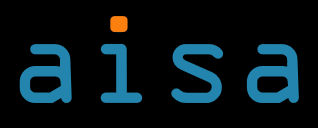

Authors: [@Jan](https://github.com/JanSeemann92) [@Katharina](https://github.com/KatharinaGI) [@Antonia](https://github.com/AntoniaJost) [@Niklas](https://github.com/niiiiikd) [@Liliana](https://github.com/GitLiliana)

# Cloud Vision 
### Applicability Estimation Tool for Spatial Prediction Models

Cloud Vision offers a simple tool for estimating the applicability of models for land use/land cover (LULC) classifications. Its special focus is on implementing the Area of Applicability (AOA) [Meyer and Pebesma (2021)](https://besjournals.onlinelibrary.wiley.com/doi/10.1111/2041-210X.13650) , a very useful method for assessing and communicating areas a model is applicable for. In addition to this Cloud Vision supports model training, making LULC classifications and suggesting locations for further sampling campaigns.

## Installation

## Getting Started

## Requirements on Input Data

### Area of Interest (AOI)

- One out of two options can be chosen: Draw a rectangle on a given leaflet map or manually enter coordinates.
- Manually entered coordinates must be given in EPSG4326.

### Training Data

- Supported data formats are Geopackage (.gpkg) and GeoJSON (.geojson).
- The LULC classes must be stored under the name "Label".
- Training data should consist of polygons.
- At least two polygons must be given for each LULC class (as spatial cross validation based on the polygons is used).

### Model
- Models must come as single R objects (.RDS).
- Models must have been trained on a selection of the following bands from sentinel-2 images: B02, B03, B04, B05, B06, B07, B08, B11, B12, B8A.
- Predictors must be named likewise: "B02", "B03", "B04", "B05", "B06", "B07", "B08", "B11", "B12", "B8A".

## Specifications

### Generating Sentinel-2 images from AWS

The following parameters can be chosen by the user within the webtool:
- Resolution of requested sentinel-2 images can be 20m (default), 40m or 80m.
- The maximum cloudcover to filter sentinel-2 images can be between 0% and 100% (default it 20%).
- An area of interest must be chosen (see Requirements on Input Data - Area of Interest).

The images contain the bands B02, B03, B04, B05, B06, B07, B08, B11, B12 and B8A.

### Model Training and Prediction
The model is trained by random forest with ntree=200 using the Labels (which store the LULC classes) as predictors. The model is validated by spatial cross validation with three folds and the polygons as spatial units. The final model is chosen by best value for kappa. 

### Estimating AOA


### Suggesting New Sampling Locations
New sampling locations are chosen randomly, but only from those areas outside the AOA. The default number of newly suggested sampling locations it 50, but it can be less or even 0 for very small or no areas outside the AOA.
# aisa 

Requirements: Node >= 14 & R >= 4.1.2

## Docker

Start:

```sh
docker-compose up
```

Open `http://44.234.41.163:8081` in your browser.

The frontend and backend are available on Docker Hub:

- `aisageosoft2/frontend`
- `aisageosoft2/backend`

## Frontend

Install and run:

```sh
cd frontend
npm install
```

```sh
npm run start
```

Test:

```sh
npm run test
```

## Backend

Install and run:

```sh
cd backend
npm install
```

```sh
npm run start
```
