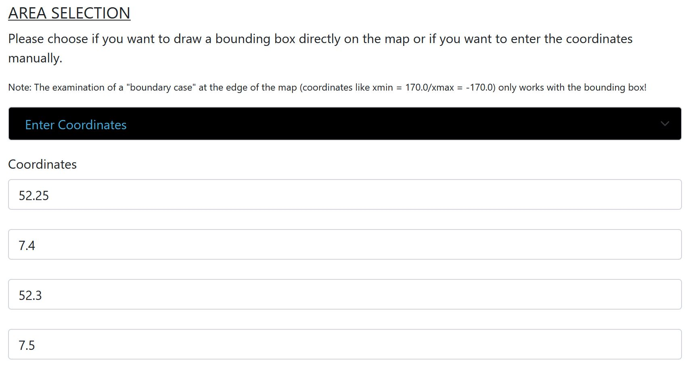
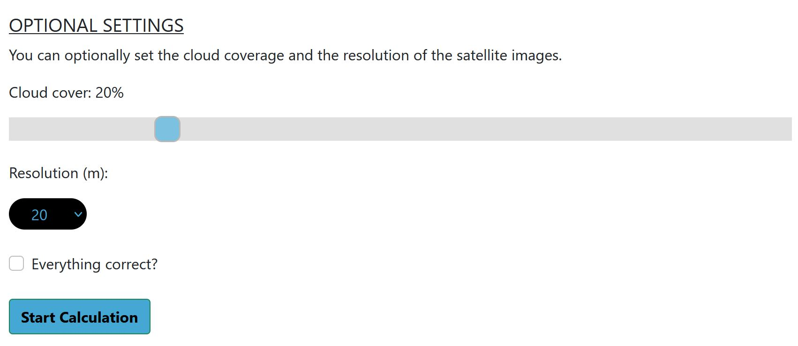
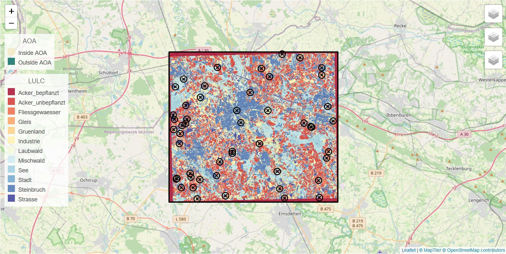

Authors: [@Jan](https://github.com/JanSeemann92) [@Katharina](https://github.com/KatharinaGI) [@Antonia](https://github.com/AntoniaJost) [@Niklas](https://github.com/niiiiikd) [@Liliana](https://github.com/GitLiliana)

# Cloud Vision 
### Applicability Estimation Tool for Spatial Prediction Models

Cloud Vision offers a simple tool for estimating the applicability of models for land use/land cover (LULC) classifications. Its special focus is on implementing the Area of Applicability (AOA) by [Meyer and Pebesma (2021)](https://besjournals.onlinelibrary.wiley.com/doi/10.1111/2041-210X.13650) , a very useful method for assessing and communicating areas a model is applicable for. In addition to that, Cloud Vision supports model training, making LULC classifications and suggesting locations for further sampling campaigns.

## Installation

### Requirements
Only relevant if installed without docker: Node >= 14 & R >= 4.1.2

### Start
To start the program on AWS Server use: 
```sh
$ cd AISA_GeosoftwareII
$ docker-compose up
```
Now you can open `http://44.234.41.163:8781` in your browser and Cloud Vision is running.

### For testing purposes

#### Frontend 

For testing the frontend on AWS Server go to `$ cd AISA_GeosoftwareII`. 
Now interactively start the container using `$ docker run -it antonia123/aisafrontend:latest /bin/bash`.
Once you're at `root@...:/app` enter `#npm run test` and all frontend related tests will be exectued.

#### Backend

For testing the backend on AWS Server start the program like mentioned above. Open `http://44.234.41.163:8782/runTests` in your browser. The result of the test will be shown after a calculation time comparable to the calculation time of the demo.

### Docker Hub
The frontend and backend image are also available in the aisa_vision_cloud repository on [Docker Hub](https://hub.docker.com/repository/docker/antonia123/aisa_cloud_vision):

- `antonia123/aisafrontend`
- `antonia123/aisabackend`
 
 To pull our Cloud Vision repository from Docker Hub enter:
 ````sh
 $ docker pull --all-tags antonia123/aisa_cloud_vision
 ````
 To check if all images have been pulled correctly use:
 ````sh
 $ docker images antonia123/aisa_cloud_vision
 ````
 The output should look like this:


Now you can start the program with `$ docker-compose up`

Please keep in mind that if you run the containers for the first time, it might take about 60 minutes to install all dependencies! If you are running Cloud Vision on your own server or device, you have to update all directory paths within the code. 

## Getting Started with Cloud Vision

User info: On machines with limited memory big data sets can crash the program! 
To get an overview of our tool we provide a step-by-step tutorial:

### Step 1
First of all, you need to select the area you're interested in (AOI). Therefore, we offer you 2 different options you can see in the dropdown bar. Once you've selected your prefered option, you'll be able to either draw a bounding box directly on the map or to enter the coordinates manually (Please pay attention to the correct format and order of the coordinates!).
<p align="center">
  
  
</p>

### Step 2
Next, you need to upload a model in .rds format or training data in .geojson/.gpkg format. You can find more detailed format information in the next section on requirements on input data.
<p align="center">
  
</p>

### Step 3
Optionally you can change the settings for the cloud cover and the resolution. Please be thoughtful when setting the resolution. It should be reasonable in relation to the traningsdata and AOI. Otherwise the calculation might not succeed.
<p align="center">
  
</p>

### Step 4
Great! Now you can start the calculation with "Start calculation". The calculation process will take a little time, so please be patient! When the calculation is finished, you will be redirected to the results and can view the calculated AOA, the prediction, the training polygons (depending on the input case) and the suggested sampling points (depends on whether there are areas outside the AOA in the area under consideration.) on a map using LayerControls.
<p align="center">
  
</p>

### Step 5
Finally, you have the possibility to download the data as a bundled .zip file by clicking on one of the download buttons. Besides your own calculated data we also offer you the demo data of our demo calculation.
<p align="center">
  
</p>

## Requirements on Input Data

### Area of Interest (AOI)
The AOI can either be entered by drawing a rectangle on a given leaflet map or by manually entering coordinates. With the second options some specifications must be followed:
- Manually entered coordinates must be given in EPSG4326.
- Manually entering coordinates does not work for areas crossing 180° E/W. In this case please draw a bounding box on leaflet.

### Training Data
- Supported data formats are Geopackage (.gpkg) and GeoJSON (.geojson).
- The LULC classes must be stored under the name "Label".
- Training data should consist of polygons.
- At least two polygons must be given for each LULC class (as spatial cross validation based on the polygons is used).
- A CRS must be given but without further requirements.

### Model
- Models must come as single R objects (.RDS).
- Models must have been trained on a selection of the bands B02, B03, B04, B05, B06, B07, B08, B11, B12 and B8A from sentinel-2 and the NDVI.
- Predictors must be named likewise: "B02", "B03", "B04", "B05", "B06", "B07", "B08", "B11", "B12", "B8A", "NDVI".

## Specifications

### Generating Sentinel-2 images from AWS
The following parameters can be chosen by the user within the webtool:
- Resolution of requested sentinel-2 images can be 20m (default), 40m or 60m.
- The maximum cloud cover to filter sentinel-2 images can be between 0% and 100% (default is 20%).
- An area of interest must be chosen (see Requirements on Input Data - Area of Interest).

The images contain the bands B02, B03, B04, B05, B06, B07, B08, B11, B12 and B8A and are filtered by the given cloud cover, given AOI (and if needed the bounding box of training data) and by time. The time filter is set to 01.01.2020 till 31.12.2020 by default. Supplementary to the bands the NDVI (B08-B04/B08+B04) is added as a predictor. Normally there will be several images (up to max. 70) fitting these parameters. Therefore images will be subsampled by using mean values of all images for every pixel using the method median.

The number of images is limited to 70 images to enable the program to run on a machine with 16GB memory. 
If the AOI or the allocation of the training polygons is too widespread, the program may abort. 

### Preprocessing Training Data and Model Training
First only those pixel which are located within the training polygons are extracted from the sentinel-2 images and the information on LULC from the labels is added. Then the data is reduced to only 10% of each polygon. In the next step the model is trained by random forest with 200 trees using the Labels (which store the LULC classes) and the sentinel bands as predictors. The model is validated by spatial cross validation with three folds and the polygons as spatial units. The final model is chosen by best value for kappa. 

### Prediction and Estimating AOA
The prediction is made for the AOI by using the appropriate sentinel-2 image and a model. The model used is either the one uploaded or the one trained before (depending on user input). Likewise the AOA is estimated for the AOI using the image and the model.

If the datasets are too big for the memory of the machine to handle, the program may abort. 

### Suggesting New Sampling Locations
New sampling locations are chosen randomly, but only from those areas outside the AOA. The default number of newly suggested sampling locations is 50, but it can be less or even 0 for very small or no areas outside the AOA. If there are not any areas ouside the AOA, no suggestions for sampling locations will be provided.
